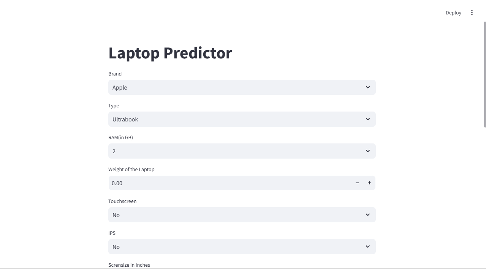

# Laptop Price Prediction Web App

This project is a **Laptop Price Prediction Web App** built using **Streamlit**, **Python**, and **Machine Learning**. The app predicts the price of a laptop based on various features like brand, RAM, weight, touchscreen, CPU, GPU, screen size, and more. The model is trained using historical laptop data and provides an estimate of the laptop's market price.

## Features

- **Brand Selection:** Choose from a variety of laptop brands.
- **Laptop Type:** Select the type of laptop (e.g., Gaming, Ultrabook, etc.).
- **RAM:** Select the amount of RAM in GB.
- **Weight:** Enter the weight of the laptop.
- **Touchscreen:** Select whether the laptop has a touchscreen.
- **IPS Display:** Choose whether the laptop has an IPS display.
- **Screen Size:** Adjust the screen size from 10 to 18 inches.
- **Resolution:** Choose from multiple screen resolutions (e.g., 1920x1080, 1366x768).
- **CPU, GPU, Storage Options:** Select CPU, GPU, HDD, and SSD options.
- **Operating System:** Choose the operating system (e.g., Windows, Linux).

The app uses a pre-trained machine learning model to predict the price of a laptop based on the selected configuration.

## Installation

To run this project locally, follow these steps:

### Prerequisites

1. Python 3.x
2. Streamlit
3. Pickle (for loading the pre-trained model and data)

### Steps

1. Clone the repository:
   git clone https://github.com/your-username/laptop-price-predictor.git
   cd laptop-price-predictor
2. Download the model and dataset pickle files (pipe.pkl and df.pkl) and place them in the project directory.
3. Run the Streamlit app:
    streamlit run app.py
4. The app will be available in your browser at http://localhost:8501

### Files
1. app.py: Main file for the Streamlit app that runs the laptop price prediction.
2. pipe.pkl: Pre-trained model used for predicting the price.
3. df.pkl: Dataset used for training the model, including laptop features.

### How it Works
1. The user selects various features (brand, type, RAM, etc.) via a simple form.
2. The app processes these inputs and uses a machine learning model to predict the laptop's price.
3. The prediction is based on a pre-trained model stored in the pipe.pkl file, which was trained on historical laptop data.

